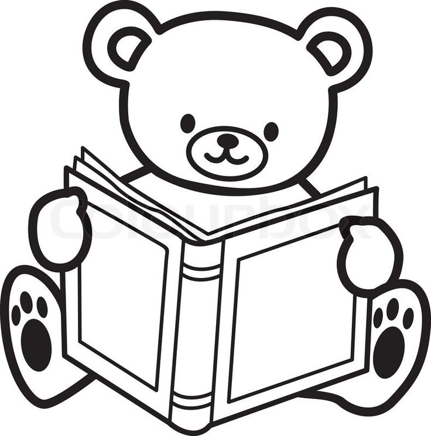

<h1 align="center"> Hello, моё имя Ровшан (Руслан) Рустамов </h1>
<ul text-decoration="none"> 
<li>
<h3 align="right" >+7 (926) 282 20 08</h3>  

</li> 
<h3 align="right" >@Korsikanec2691</h3> 
<li>
</li> 
</ul>

 A few words about yourself. I am 50+ years old, a civil engineer by profession. I am very attracted to programming. Therefore, I decided to master the frontend direction in programming. To do this, I decided to become a student at RS-School. I've read a lot of positive reviews about this school, and besides, the tuition is free. I like to overcome difficulties and solve difficult tasks. I would like to express my sincere gratitude to the creators and teachers of the school for the work they have done to train a large number of strong programmers.

